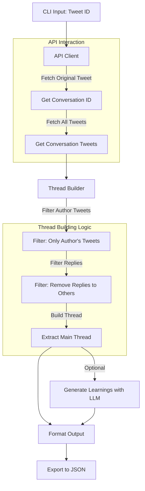

# X Thread Extractor

A command-line tool to extract main threads from X (Twitter) conversations without replies.

## Features

- Extract the main thread from a conversation
- Filter out replies, including those from the original author
- Generate key learnings from the thread using an LLM (via OpenRouter)
- Export results to JSON

## How It Works



## Installation

### Using Poetry (recommended)

```bash
# Clone the repository
git clone https://github.com/glenn-s-santoso/x-thread-extractor.git
cd x-thread-extractor

# Install dependencies with Poetry
poetry install

# Activate the virtual environment
poetry shell
```

### Using Virtual Environment

```bash
# Clone the repository
git clone https://github.com/yourusername/x-thread-extractor.git
cd x-thread-extractor

# Create a virtual environment
python -m venv venv

# Activate the virtual environment
# On Linux/macOS
source venv/bin/activate
# On Windows
# venv\Scripts\activate

# Install dependencies
pip install -r requirements.txt
```

## Configuration

Create a `.env` file in the root directory with the following content:

```
X_BEARER_TOKEN=your_x_bearer_token
OPENROUTER_API_KEY=your_openrouter_api_key
```

## Usage

```bash
# Extract a thread and generate learnings
extract --tweet-id <tweet_id> --output thread_output.json

# Extract a thread without generating learnings
extract --tweet-id <tweet_id> --no-learnings --output thread_output.json

# Get help
extract --help